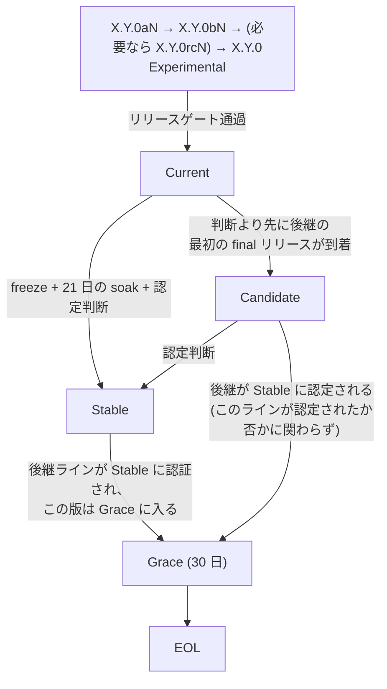

<!-- i18n-source: docs/RELEASE_LIFECYCLE_STANDARD.md@blob:22859ac3ae7052ed3488f5db3efc2bc47ec8495a -->

# リリースライフサイクル標準 (v1.4)

Cloto ファミリーのプロジェクト向けの、3 ティアのリリースライフサイクルおよび
サポートの標準です。本ドキュメントは**仕様**であり、これを採用するリポジトリ
は、ここにあるテンプレートから導出した自前の運用ポリシーとして `SUPPORT.md`
(ティア表 + ステータス) と `SECURITY.md` を公開します。

> **翻訳について**: 本標準の規範的な正本は英語版です。記述が食い違う場合は
> 英語版が優先されます (右上の言語切替から参照できます)。

## この文書のステータス { #status-of-this-document }

**パイロット運用中。** 本標準は、互いに補完的な役割を持つ 2 つのリポジトリで
パイロット運用されています: **cpersona** (ポリシー運用と品質ベースラインの
リファレンス実装) と **ClotoCore** (**構造的強制**のリファレンス実装 — ティア
の規則がレジストリ上の慣習として適用されるのではなく、update-channel /
release-manifest のパイプラインに焼き込まれています。同リポジトリの
`docs/RELEASE_PIPELINE_DESIGN.md` を参照)。以下のすべての規則は、ファミリー
全体への採用に先立ち、実際のリリースに対して実行され検証されます。Cloto
ファミリーの**パブリック**リポジトリは、パイロットが評価基準 (§6) を満たした
時点で段階的に本標準を採用します。プライベートリポジトリは対象外です。

正本の所在: パイロット運用中は本リポジトリです。本標準がファミリー全体で採用
された場合、正本の所在はファミリーレベルのリポジトリへ移る可能性があり、その
際は本ドキュメントがそこへのポインタになります。

## 1. ティア { #1-tiers }

各リリースライン (例: 2.4.x) は、常にちょうど 1 つのティアに属します。ティア
は個々のバージョンではなく**ライン**に紐づきます。

| ティア | 意味 | 修正ポリシー |
| --- | --- | --- |
| **Stable** | 本番環境での soak を経てメンテナが認定したライン。全ユーザーに推奨され、既定の配布チャネル (例: マーケットプレイスの pin) はこのラインを配信します。 | クリティカルなバグ修正、データ損失の修正、セキュリティ修正のみ。メンテナの裁量でバックポートされます。 |
| **Current** | 最新のリリースライン。リポジトリのフルのリリースゲートは通過済みですが、本番環境での認定はまだ受けていません。常にちょうど 1 つのラインが Current です。 | すべてのバグ修正はまずここに入ります。開発が行われるのはこのラインです。 |
| **Candidate** | すでに最新ではないものの、その認定 (§2.3) が決着していないライン — 後継の最初の final リリースが、自身の判断より先に到着したもの。どの配布チャネルもこれを配信せず (§4)、正確なバージョン指定でのみ到達できます。 | クリティカル・セキュリティ・データ損失の修正は技術的に可能な限りバックポートされ、それ以外の修正はメンテナの裁量です。 |
| **Experimental** | 次期ラインの alpha / beta (必要なら rc) の pre-release。opt-in 専用で、いかなる保証もありません。 | 修正は次の pre-release で出荷されます。 |

用語についての注記: **Current** は Node.js のリリースフェーズの語彙 (本番ティア
とは区別される、サポート対象の最新ライン) に倣っています — BSD の開発 HEAD で
ある `-CURRENT` ではありません。その役割はここでは **Experimental** が担います。
**Experimental** は React のリリースチャネルの用法 (opt-in、保証なし) に一致し
ます。Stable の修正ゲートは Node.js の Maintenance LTS ("critical bug fixes and
security updates") および Linux カーネルの stable ルールに一致します。

## 2. ライフサイクル { #2-lifecycle }

### 2.1 Pre-release (Experimental) { #21-pre-releases-experimental }

- Python プロジェクトは PEP 440 の正規バージョン文字列 (`2.5.0a1`、
  `2.5.0b1`、`2.5.0rc1`) を使い、git タグは 1:1 で対応します (`v2.5.0a1`)。
  Python 以外のプロジェクトは、同じステージ意味論のまま、各エコシステムの
  pre-release 表記 (例: semver の `-alpha.1`) を使います。
- インストーラレベルでの opt-in 性質を成立させなければなりません (MUST):
  素のインストールが pre-release に解決されることは決してありません (pip は
  `--pre` なしでは pre-release を除外します。他のエコシステムも pre-release
  フラグ / dist-tag で同じ効果を得ます)。
- `rc` ステージは任意です。alpha → beta → final が既定の ladder です。
- **この ladder はリスクによって発火するものであり、一律ではありません。**
  ロールバック安全でない変更 — データベーススキーマまたはデータのマイグレー
  ション、公開ツール / API 契約の破壊、既定の挙動の変更 — を含むリリースは、
  pre-release ladder を通らなければなりません (MUST)。**追加的で挙動を保存
  する**リリースは、ladder を省略して direct-to-final でリリースしてもよい
  (MAY) (§2.1 のインストーラ opt-in 性質および §4 の配布マッピングと整合しま
  す — direct な final は単に Current の最新リリースになるだけです)。迷った
  場合は ladder を使ってください。

### 2.2 リリースゲート (Current への入場) { #22-release-gate-entry-into-current }

各リポジトリは自身のゲートを定義します。ゲートには最低限、フルのテストスイート
と lint を含めなければなりません (MUST)。cpersona でのゲートは、pytest スイート
(構造ゲートを含む)、ruff、issue レジストリの検証 (`verify-issues.sh`)、および
相当量のバッチに対する包括的なマルチエージェント監査です。

### 2.3 認定 (Stable への昇格) { #23-certification-promotion-to-stable }

認定は、**期限付きの時計**の上で行われるメンテナの明示的な判断です (v1.4)。
v1.3 には時計がなく、その終わりの見えない soak によって、あるラインの欠陥記録が
後継のリリースを足止めしていました。また Current の定義上、判断より先に置き換え
られたラインに与えるティアがありませんでした。日付はすべて UTC の暦日です。

1. **Freeze。** メンテナはラインの凍結を宣言します — これは日付を伴うイベント
   であり、リポジトリの `SUPPORT.md` のステータス表に記録されます。その日から
   ラインは freeze 対象として適格な修正のみを受け入れます (§2.6)。フィーチャー
   リリースは freeze を撤回させます。
2. **Soak。** 凍結されたラインは、リポジトリが明示した soak 環境 (cpersona の
   場合: 本番の ClotoCore デプロイ) で **21 日間**稼働します。評価の対象は、
   判断日時点でのそのラインの最新リリースです。
3. **判断。** freeze + 21 日の時点で、メンテナは 2 つの結果のいずれかを記録
   します。soak 中に見つかったクリティカルまたは高深刻度の欠陥が、判断日時点で
   次のいずれかのテストに失格しない限り、ラインは**認定**されます: まだ open で
   あること、あるいはその修正がリリースされ soak 環境にデプロイされ、そこで
   少なくとも **7 日間**観測されていないこと。issue のクローズだけではどちらの
   テストも満たしません — 認定されるのはデプロイされた成果物です。そうでない
   場合、判断は保留ではなく**否定**です。
4. **再審査 (最大 1 回)。** 否定の判断から 14 日以内に、メンテナは再審査を宣言
   してもよい (MAY)。2 度目の判断は宣言から 14 日後に、同じテストにより、指名
   された修正の差分検証として行われます。修正が公開契約・既定値・データ形式・
   スキーマを変更する場合は、代わりにラインを再凍結します (新たな 21 日)。
   2 度目の否定の判断、あるいは 14 日以内に再審査が宣言されないことは、認定
   しないまま認定を**決着**させます。

認定は、そのラインが最新であることを要求しません: Candidate (§1) になった
ラインも同じ時計で判断されます。より新しいラインが既に Stable である状態で
ラインが認定された場合、その認定は記録され、ラインは直ちに Grace に入ります —
Stable の pin が後戻りすることは決してありません (§4)。

認定日はステータス表に記録され、置き換えられた Stable ラインの grace ウィンドウ
を開始させます (§2.4)。一度も凍結されないラインが認定されることはありません:
後継が認定される時点で freeze が宣言されていない Candidate は、それと共に Grace
に入ります。

### 2.4 Grace ウィンドウ { #24-grace-window }

後継ラインが Stable として認定されると、置き換えられたラインは**認定日から
30 日間**その Stable の修正ポリシーを維持し、その後 EOL に到達します。

- 時計は認定イベントを起点とします。ウィンドウ内のパッチリリースはこれを
  リセット**しません**。
- **Candidate** のライン (§1) — 遅れて認定された、認定されないまま決着した、
  あるいは一度も凍結されなかったもの — は、その後継が Stable に認定された時点で
  Grace に入り、同じ 30 日のウィンドウが適用されます。それまでは Candidate の
  修正ポリシーを維持します。サポートが取り下げられるのは、認定された代替が
  利用可能になったことによるのであって、そのライン自身の判断の結果によるので
  はありません。
- 複数のラインが同時に Grace にあってもよい (MAY)。各ウィンドウの終了日は開始
  時点で確定し、後の認定がそれを短縮することもリセットすることもありません。
  また認定は、それが直接置き換えるラインについてのみ Grace を開始させます。
- ウィンドウ内に受理された問題の修正は、ウィンドウが閉じた後に出荷されること
  があります。
- 移行がデータベーススキーマまたはデータのマイグレーションを必要とする場合
  (cpersona のライン移行は DB スキーマを保存しますが、MCP ツール契約は無条件
  には保存されません — 2.5.2 は §2.1 の ladder の下でこれを破壊しました)、
  メンテナは後継を認定する前にウィンドウを延長すべきです (SHOULD)。

### 2.5 EOL { #25-eol }

以後の修正はありません。EOL 後のセキュリティ修正はメンテナの単独裁量であり、
当てにしてはなりません。

### 2.6 ライン内でのフィーチャーリリース { #26-feature-releases-within-a-line }

§2 のライフサイクル図はラインの誕生 (`X.Y.0`) を示すものであって、そのライン
の開発の終わりを示すものではありません。**Current** にあるラインは、バグ修正
リリースに加えてフィーチャーリリース (`X.Y.1`、`X.Y.2`、…) を受け入れてもよい
(MAY):

- ライン内の各リリースは、§2.1 のリスクトリガーに従って自身の経路を選びます:
  追加的なフィーチャーリリースは direct-to-final で進んでよく、ロールバック
  安全でない変更はライン内リリースではなく**次の**ライン (`X.(Y+1).0`) に
  属します。
- **凍結された**ライン (§2.3) は、freeze 対象として適格な修正のみを受け入れ
  ます。ある変更が freeze 適格であるのは、次の 3 つがすべて成り立つときです:
  正準の欠陥記録またはセキュリティ記録を参照していること、契約・ドキュメント・
  freeze 前のリリースが確立した挙動を回復するものであること、そしてその挙動の
  回復に厳密に必要な範囲を超えて、ツール・オプション・レスポンスフィールド・
  既定値・サポート対象の構成・スキーマ・マイグレーションを追加しないこと。
  それ以外のユーザーに見える変更は、規模に関わらずフィーチャーであり、次の
  ラインを対象とします — 「追加的」や「ロールバック安全」であることは、凍結
  されたラインへの入場を認めません。修正リリースは 21 日をやり直させず、§2.3 の
  修正後 7 日間の観測を開始させます。フィーチャーリリース、あるいはそれ自体が
  ロールバック安全でない修正は、freeze を撤回させます: メンテナはそれを再宣言
  する (新たな 21 日) か、ラインを凍結しないままにします。
- **Stable** のラインはフィーチャーリリースを受け入れません — その修正ポリシー
  (§1) が既に、クリティカル・データ損失・セキュリティの修正に限定しています。
  フィーチャーは常に Current (あるいは次の Experimental) のラインを対象とします。

### 2.7 初期状態 (認定済みの Stable ラインが無い) { #27-initial-state-no-certified-stable-line }

リポジトリの**最初の**認定イベント以前は、Stable のラインは存在しません。その
状態では:

- 既定の配布チャネルは **Current** のラインを配信しなければなりません (MUST)
  (すなわち `stable` チャネルは最初の認定まで `current` のエイリアスになります)。
- 利用者に向いた面では、まだ Stable として認定されたラインが無いことを述べる
  べきです (SHOULD) (例: `SUPPORT.md` のステータス表に "Stable line not yet
  certified" の注記を置き、該当する場合は更新 UI にも置く)。
- インストーラの opt-in 性質 (§2.1) は引き続き成立します: エイリアスされた
  既定チャネルが pre-release に解決されることは決してありません。
- 最初の認定でエイリアスは実際の pin に置き換わり、以後は §2.3–§2.5 がその
  まま適用されます。

### 2.8 監査所見の識別子 { #28-audit-finding-identifiers }

リリースゲートの監査 (pre-release ladder における大規模レビュー、§2.1) は所見
レポートを生み出します。採用リポジトリはさらに機械検査される issue レジストリ
(cpersona では `qa/issue-registry.json`) を保持し、その id (`bug-NNN`) が欠陥の
正準かつ恒久的な識別子です。2 つの id 空間が互いを汚染しないよう、2 つの規則を
置きます:

- **監査レポートは深刻度の頭文字による所見 id を使う** — `C-NN` (CRITICAL)、
  `H-NN` (HIGH)、`M-NN` (MEDIUM)、`L-NN` (LOW)。ゼロ埋めし、1 回の監査の中で
  一意とします。裸の `C` プレフィックスは CRITICAL のために予約されており、
  それ以外の用途 (例: 「cluster」) に使ってはなりません (MUST NOT)。ワーク
  フロー内部の作業 id (クラスタ番号、finder id) は監査の実行中に存在してよい
  ものの、レポートの公開所見 id ではありません。
- **ツリーに入る id は正準 id のみ。** コードコメントと修正マーカー、テスト名、
  レジストリのパターンは、欠陥をもっぱらレジストリ id (`bug-NNN`) で参照します。
  正準 id は修正の実装が始まる**前に**採番されるため、修正ブリーフ・回帰テスト・
  レジストリのエントリは生まれた時点で正準です。監査 id は PR 本文や監査レポート
  の中で相互参照として正準 id に併記してよい (`bug-114 (H-03)`) ものの、コード中
  に単独で現れることは決してありません。

### 2.9 暫定パラメータとその見直し { #29-provisional-parameters-and-their-review }

21 日の soak、修正後 7 日間の観測、1 回限りの再審査とその 14 日のウィンドウ
(§2.3) は、運用実績のないまま v1.4 で設定されたものです。これらはライフサイクル
に liveness を与えるスケジューリングのパラメータであって、測定された信頼度の
閾値ではありません。1 つの soak 環境における経過時間は、サポート対象のあらゆる
構成が試されたことを立証しません。認定が主張するのは、認定記録 (§3) が観測され
たと述べていることちょうどそれだけです。

メンテナは、採用リポジトリ全体で最初の 2 回の認定試行が決着した後、あるいは
2027-03-01 のいずれか早い時点で、本標準の次の改訂においてこれらのパラメータを
見直します — さらに、2 回連続で判断が否定となった場合、または再審査の後に
ラインが認定されないまま決着した場合には、それより早く見直します。トリガーが
義務づけるのは見直しと結果の記録 (§8) であって、あらかじめ定まった変更では
ありません。

### 2.10 緊急の pin ロールバックと認定取り消し { #210-emergency-pin-rollback-and-decertification }

認定は記録されたイベントであり、書き換えられません。認定後に Stable のラインで
重大な欠陥が表面化した場合、日付を伴う 2 つの別個のアクションがあります:
**緊急ロールバック**は、インシデント対応として既定の配布 pin を直前の認定済み
ラインへ戻すもので、ステータス表に記録され、修正が出荷された時点で元に戻され
ます。**認定取り消し**は、そのラインの Stable ステータスを取り下げ、その Grace
ウィンドウを開始させます。いずれも他方を含意しません。

## 3. 必要な成果物 (採用リポジトリごと) { #3-required-artifacts-per-adopting-repository }

1. `SUPPORT.md` — 運用ポリシー: ティア表、ライフサイクルの要約、および
   リポジトリの**ステータス表** (ライン / ティア / 認定・EOL の日付)。
2. `SECURITY.md` — `SUPPORT.md` を参照するサポート対象バージョンの表と、
   非公開の脆弱性報告チャネル。
3. その両方を指し示す短い README のセクション。

cpersona の `SUPPORT.md` / `SECURITY.md` がリファレンステンプレートです。

4. 判断ごとの**認定記録** (v1.4)。ステータス表からリンクします: 凍結された
   ラインと評価対象の正確なリリース、freeze と判断の日付、soak 環境における
   デプロイのタイムスタンプ、soak 期間中のツール別または主要コードパス別の
   操作回数、試されたトランスポートと構成、コーパスの規模、そして試されて
   いないと分かっている構成。「認定済み」という語が指すのはこの記録です。

## 4. 配布マッピング { #4-distribution-mapping }

- **マーケットプレイス / ハブ**: 既定の pin は **Stable** のラインを配信します。
  pin が切り替わるのは認定時であって、リリース時ではありません。チャネルの
  不変条件 (v1.4): `stable` はちょうど 1 つのライン — EOL でない認定済みの
  うち最新のもの — に解決され、`current` はちょうど 1 つのライン — 最新の
  final — に解決されます。§2.10 の緊急ロールバックによる場合を除き、いずれも
  より低いバージョンへ移動しません。Candidate のラインはチャネルを持たず、
  正確なバージョン指定でのみ到達できます。正確な pin やライン別の pin を提供
  する採用者は、それらがパッチリリースに追随するかどうかを文書化します。
- **PyPI / レジストリ**: `latest` は自然に Current の最新の final リリースへ
  解決されます。Experimental は pre-release フラグの向こう側に留まります。
- **GitHub Releases**: pre-release には "Pre-release" フラグが付き、"Latest"
  バッジは Current を追跡します。
- **更新マニフェスト / フィード** (自前のアップデータを配布するリポジトリ):
  フィードはティアごとに 1 つのチャネルを露出し、名前はティア名をそのまま使い
  ます。既定チャネルは `stable` で、その pin は認定時 (§2.3) に切り替わります。
  これにより §2.1 と上のマーケットプレイスの規則が、慣習ではなく構造として効く
  ようになります。リファレンス実装: ClotoCore のリリースパイプライン。

## 5. 採用チェックリスト (新規リポジトリ向け) { #5-adoption-checklist-for-a-new-repository }

- [ ] テンプレートから `SUPPORT.md` / `SECURITY.md` をコピーし、ステータス表に
      そのリポジトリの現行ラインを記入する。
- [ ] リポジトリのリリースゲート (§2.2) と soak 環境 (§2.3) を定義する。
- [ ] pre-release に対するインストーラの opt-in 性質を検証する (§2.1)。
- [ ] 既定の配布チャネルを Stable のラインに向ける (§4)。
- [ ] README のポインタセクションを追加する。
- [ ] 本ドキュメントの §7 レジストリに採用を記録する。

## 6. パイロットの評価基準 { #6-pilot-evaluation-criteria }

パイロットは、以下が満たされた時点で成功とみなされ、ファミリー全体への採用が
解禁されます:

1. cpersona でライフサイクルが 1 周完了すること (2.5.x: Experimental →
   Current → Stable 認定、2.4.x: Grace → EOL)。しかも**ポリシーが、自身では
   表現できないその場しのぎの判断を強いることなく**完了すること (そうした
   欠落はすべて標準側の欠陥です: 標準を修正し、そのバージョンを上げます)。
2. 機械的なフックが仕様どおりに振る舞うこと: pip の pre-release 除外、認定時の
   ハブ pin の切り替え、ステータス表の記帳。
3. ティアの語彙や grace ウィンドウの意味論に起因する、利用者側の混乱インシデント
   が発生しないこと。

失敗はパイロットを中止させません。クリーンな 1 周が通るまで標準 (v1.x) を反復
します。

## 7. 採用レジストリ { #7-adoption-registry }

| リポジトリ | 標準バージョン | 採用日 | 備考 |
| --- | --- | --- | --- |
| cpersona | v1.4 | 2026-07-09 | パイロット / リファレンス実装 (ポリシー運用)。最新の標準バージョンに追随します (正本の所在)。 |
| ClotoCore | v1.3 | 2026-07-12 | 2 つ目のパイロット / リファレンス実装 (update-channel + 署名済みマニフェストのパイプラインによる構造的強制、`docs/RELEASE_PIPELINE_DESIGN.md`)。同リポジトリのマニフェストは、リリースのチャネルを pre-release サフィックスと `stable_line` のみから導出し、`current` は既に最新の final へ解決するため、v1.4 の Candidate ティアはパイプラインの変更を必要としません。この行は、当該リポジトリが freeze / 判断の語彙と認定記録を採用した時点で v1.4 へ移ります。 |

## 8. 変更履歴 { #8-changelog }

- **v1.4 (2026-09-02)** — 期限付きの認定 (§2.3): 日付を伴う freeze、21 日の
  soak、保留ではなく否定となる判断、issue のクローズではなくデプロイされた
  成果物に対するテスト、そして最大 1 回の再審査。判断より先に置き換えられた
  ラインのための **Candidate** ティア (§1) により、後継の final リリースが
  先行ラインの認定を待つことはなくなりました。Grace は認定された代替の利用
  可能性に紐づけられ (§2.4)、freeze 適格な修正を定義し (§2.6)、見直し義務を
  伴う暫定パラメータを置き (§2.9)、緊急ロールバックと認定取り消しを別個の
  記録されるアクションとし (§2.10)、認定記録 (§3) とチャネルの不変条件 (§4)
  を導入しました。cpersona 2.5.x で表面化しました。そこでは終わりの見えない
  soak が 2.6.0 のリリース日を 2.5.x の欠陥記録に結びつけ、Current の「最新の
  ライン」という定義により、2.6.0 が出荷された時点で 2.5.x に与えるティアが
  ありませんでした。Node.js の予定された LTS 移行、既知のリグレッションを抱え
  たまま出荷しつつクリティカルな欠陥は排除する Linux と Rust のリリース慣行、
  Debian の oldstable の重なり、および RFC 6410 による未観測のレビュー規則の
  削除に照らしてベンチマークしました。
- **v1.3 (2026-07-23)** — 監査所見の識別子の規約 (§2.8): 深刻度の頭文字による
  レポート id、ツリー内では正準レジストリ id のみ、実装より前の正準採番。
  cpersona 2.5.2a2 の是正作業で表面化しました。そこではクラスタ番号方式の
  `C##` が深刻度頭文字の系譜と衝突し (クラスタ id が CRITICAL と誤読された)、
  監査の作業 id が疑似マーカーとしてコードコメント・テスト名・レジストリの
  パターンへ漏れ出したため、正準化のパスが必要になりました。
- **v1.2 (2026-07-16)** — リスク駆動の pre-release ladder の基準 (§2.1) と
  ライン内フィーチャーリリースの規則 (§2.6)。2.5.1 の計画議論 (サーバー提供の
  operating context、`X.Y.0` がまだ Experimental にあるラインを対象とした追加的
  フィーチャー) で表面化しました — いずれも §6 の「標準側の欠陥」であり、標準
  自身の手順に従って修正しています。旧 §2.6 は §2.7 に採番し直しました。
- **v1.1 (2026-07-12)** — 認定済みの Stable ラインを持たないリポジトリ向けの
  初期状態の規則 (現 §2.7。ClotoCore の採用で表面化した §6 の「標準側の欠陥」
  であり、標準自身の手順に従って修正)。配布マッピング (§4) への更新マニフェスト
  / フィードの行。2 つ目のパイロット (構造的強制のリファレンス) としての
  ClotoCore の登録。
- **v1.0 (2026-07-09)** — 最初の標準。cpersona のポリシー議論から抽出し、語彙と
  規則を OSS の慣行 (Node.js のリリースフェーズ、React のリリースチャネル、
  Debian の oldstable / Firefox ESR の猶予期間の前例、カーネルの stable ルール、
  PEP 440) に照らしてベンチマークしました。
