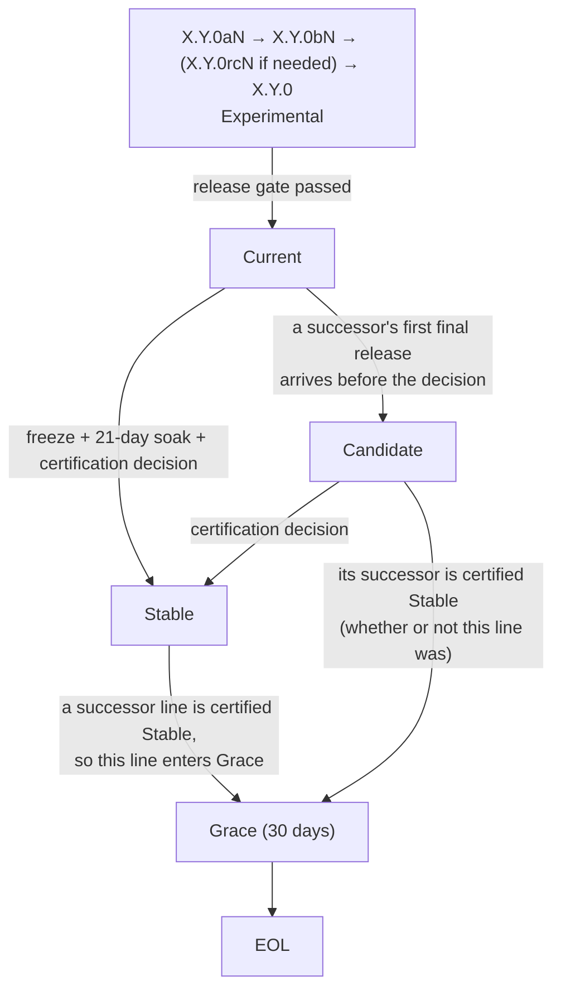

# Release Lifecycle Standard (v1.4)

A three-tier release lifecycle and support standard for Cloto-family
projects. This document is the **specification**; a repository adopting it
publishes its own operative `SUPPORT.md` (tier table + status) and
`SECURITY.md` derived from the templates here.

## Status of this document

**Pilot.** This standard is piloted in two repositories with complementary
roles: **cpersona** (reference implementation for policy operation and
quality baseline) and **ClotoCore** (reference implementation for
**structural enforcement** — the tier rules are baked into its
update-channel / release-manifest pipeline rather than applied by registry
convention; see its `docs/RELEASE_PIPELINE_DESIGN.md`). Every rule below is
exercised and validated against real releases before family-wide adoption.
Cloto-family **public** repositories adopt the standard incrementally once
the pilot passes its evaluation criteria (§6). Private repositories are
exempt.

Canonical home: this repository, while the pilot runs. If the standard is
adopted family-wide, the canonical home may move to a family-level
repository, and this document will become a pointer to it.

## 1. Tiers

Every release line (e.g. 2.4.x) is in exactly one tier at any time. The
tier attaches to the **line**, not to an individual version.

| Tier | Meaning | Fix policy |
| --- | --- | --- |
| **Stable** | Certified by the maintainer after production soak. Recommended for all users; default distribution channel (e.g. the marketplace pin) serves this line. | Critical bug fixes, data-loss fixes, and security fixes only, backported at the maintainer's discretion. |
| **Current** | The newest release line. Passed the repository's full release gate but not yet production-certified. Exactly one line is Current at any time. | All bug fixes land here first; this is where development happens. |
| **Candidate** | A line that is no longer the newest but whose certification (§2.3) has not concluded — its successor's first final release arrived before its decision. No distribution channel serves it (§4); it is reachable by exact version. | Critical, security and data-loss fixes are backported when technically feasible; other fixes at the maintainer's discretion. |
| **Experimental** | Alpha / beta (and, when needed, rc) pre-releases of the next line. Opt-in only; no guarantees. | Fixes ship in the next pre-release. |

Vocabulary note: **Current** follows the Node.js release-phase vocabulary
(the newest supported line, distinct from the production tier) — not the BSD
`-CURRENT` development head, whose role is played by **Experimental** here.
**Experimental** matches React's release-channel usage (opt-in, no
guarantees). The Stable fix gate matches Node.js Maintenance LTS ("critical
bug fixes and security updates") and the Linux kernel stable rules.

## 2. Lifecycle

### 2.1 Pre-releases (Experimental)

- Python projects use PEP 440 canonical version strings (`2.5.0a1`,
  `2.5.0b1`, `2.5.0rc1`); git tags match 1:1 (`v2.5.0a1`). Non-Python
  projects use their ecosystem's pre-release notation (e.g. semver
  `-alpha.1`) with the same stage semantics.
- The installer-level opt-in property MUST hold: a plain install never
  resolves to a pre-release (pip excludes pre-releases without `--pre`;
  other ecosystems use pre-release flags / dist-tags to the same effect).
- The `rc` stage is optional; alpha → beta → final is the default ladder.
- **The ladder is risk-triggered, not universal.** A release MUST go through the
  pre-release ladder when it contains a change that is not rollback-safe: a
  database schema or data migration, a break in the public tool/API contract,
  or a change to default behavior. An **additive, behavior-preserving** release
  MAY skip the ladder and release direct-to-final (consistent with the
  installer opt-in property in §2.1 and the distribution mapping in §4 — a
  direct final simply becomes Current's newest release). When in doubt, use
  the ladder.

### 2.2 Release gate (entry into Current)

Each repository defines its own gate, which MUST at minimum include its full
test suite and lint. In cpersona the gate is: pytest suite (including the
structural gates), ruff, issue-registry verification (`verify-issues.sh`),
and comprehensive multi-agent audits for substantial batches.

### 2.3 Certification (promotion to Stable)

Certification is an explicit maintainer decision taken on a **bounded
clock** (v1.4). v1.3 had no clock; its open-ended soak let one line's
defect record hold up its successor's release, and its definition of
Current left no tier for a line superseded before certification. All
dates are calendar days in UTC.

1. **Freeze.** The maintainer declares the line frozen — a dated event
   recorded in the repo's `SUPPORT.md` status table. From that date the
   line takes freeze-eligible fixes only (§2.6); a feature release
   withdraws the freeze.
2. **Soak.** The frozen line runs in the repository's named soak
   environment (for cpersona: the production ClotoCore deployment) for
   **21 days**. The assessment covers the line as of its newest release on
   the decision date.
3. **Decision.** On freeze + 21 days the maintainer records one of two
   outcomes. The line is **certified** unless a critical or high-severity
   defect found during the soak fails either test on the decision date:
   it is still open, or its fix has not been released, deployed to the
   soak environment and observed there for at least **7 days**. Issue
   closure alone satisfies neither test — the deployed artifact is what is
   being certified. Otherwise the decision is **negative**, not deferred.
4. **Re-review (at most once).** Within 14 days of a negative decision the
   maintainer MAY declare a re-review; a second decision is taken 14 days
   after the declaration, on the same tests, as a delta verification of
   the named fixes. If the fix changes a public contract, a default, a
   data format or a schema, the line is re-frozen instead (a new 21 days).
   A second negative decision, or no re-review declared within the 14
   days, **concludes** certification without certifying.

Certification does not require the line to be the newest one: a line that
became a Candidate (§1) is decided on the same clock. When a line is
certified while a newer line is already Stable, the certification is
recorded and the line enters Grace at once — the Stable pin never moves
backward (§4).

The certification date is recorded in the status table; it starts the
superseded Stable line's grace window (§2.4). Lines that are never frozen
are never certified: a Candidate whose freeze has not been declared by the
time its successor is certified enters Grace with it.

### 2.4 Grace window

When a successor line is certified Stable, the superseded line keeps its
Stable fix policy for **30 days from the certification date**, then reaches
EOL.

- The clock anchors on the certification event; patch releases inside the
  window do NOT reset it.
- A **Candidate** line (§1) — certified late, concluded without
  certification, or never frozen — enters Grace when its successor is
  certified Stable, with the same 30-day window. Until then it keeps the
  Candidate fix policy. Support is withdrawn on the availability of a
  certified replacement, not on the outcome of the line's own decision.
- Several lines MAY be in Grace at the same time. Each window's end date is
  fixed when it starts; a later certification neither shortens nor resets
  an earlier one, and starts Grace only for the line it directly
  supersedes.
- Fixes for issues accepted within the window may ship after it closes.
- If a transition requires a database schema or data migration (cpersona
  line transitions preserve the DB schema; the MCP tool contract is not
  preserved unconditionally — 2.5.2 broke it under the ladder of §2.1),
  the maintainer SHOULD extend the window before certifying the successor.

### 2.5 EOL

No further fixes. Post-EOL security fixes are at the maintainer's sole
discretion and must not be relied upon.

### 2.6 Feature releases within a line

The lifecycle diagram in §2 shows the birth of a line (`X.Y.0`); it is not the
end of the line's development. A line in **Current** MAY take feature releases
(`X.Y.1`, `X.Y.2`, …) in addition to bug-fix releases:

- Each in-line release chooses its own path by the risk trigger in §2.1:
  additive feature releases may go direct-to-final; rollback-unsafe changes
  belong to the **next** line (`X.(Y+1).0`), not to an in-line release.
- A **frozen** line (§2.3) takes freeze-eligible fixes only. A change is
  freeze-eligible when all three hold: it references a canonical defect or
  security record; it restores behaviour that a contract, the documentation
  or the pre-freeze release established; and it adds no tool, option,
  response field, default, supported configuration, schema or migration
  beyond what restoring that behaviour strictly needs. Every other
  user-visible change is a feature, whatever its size, and targets the next
  line — "additive" or "rollback-safe" does not admit it to a frozen line.
  A fix release does not restart the 21 days; it starts the 7-day post-fix
  observation of §2.3. A feature release, or a fix that is itself
  rollback-unsafe, withdraws the freeze: the maintainer either re-declares
  it (a new 21 days) or leaves the line unfrozen.
- A **Stable** line takes no feature releases — its fix policy (§1) already
  restricts it to critical, data-loss, and security fixes. Features always
  target the Current (or next Experimental) line.

### 2.7 Initial state (no certified Stable line)

Before a repository's **first** certification event, no Stable line exists.
In that state:

- The default distribution channel MUST serve the **Current** line (i.e. a
  `stable` channel aliases `current` until first certification).
- Consumer-facing surfaces SHOULD state that no line has been certified
  Stable yet (e.g. a "Stable line not yet certified" note in the
  `SUPPORT.md` status table and, where applicable, in update UI).
- The installer opt-in property (§2.1) still holds: the aliased default
  channel never resolves to a pre-release.
- The first certification replaces the alias with a real pin; from then on
  §2.3–§2.5 apply unchanged.

### 2.8 Audit finding identifiers

Release-gate audits (the pre-release ladder's large-scale reviews, §2.1)
produce finding reports; adopting repositories also keep a machine-checked
issue registry (cpersona: `qa/issue-registry.json`) whose ids (`bug-NNN`) are
the canonical, permanent identifiers for defects. Two rules keep the two id
spaces from corrupting each other:

- **Audit reports use severity-initial finding ids** — `C-NN` (CRITICAL),
  `H-NN` (HIGH), `M-NN` (MEDIUM), `L-NN` (LOW), zero-padded, unique within
  one audit. The bare `C` prefix is reserved for CRITICAL; it MUST NOT be
  used for anything else (e.g. "cluster"). Workflow-internal working ids
  (cluster numbers, finder ids) may exist while the audit runs but are not
  the report's public finding ids.
- **Only canonical ids enter the tree.** Code comments and fix markers, test
  names, and registry patterns refer to defects exclusively by registry id
  (`bug-NNN`). Canonical ids are assigned BEFORE fix implementation begins,
  so fix briefs, regression tests, and registry entries are born canonical.
  Audit ids may accompany canonical ids as cross-references in PR bodies and
  audit reports (`bug-114 (H-03)`); they never appear alone in code.

### 2.9 Provisional parameters and their review

The 21-day soak, the 7-day post-fix observation, the single re-review and
its 14-day windows (§2.3) were set in v1.4 without operating history. They
are scheduling parameters that give the lifecycle liveness; they are not
measured confidence thresholds, and elapsed time in one soak environment
does not establish that every supported configuration was exercised. What
a certification asserts is exactly what the certification record (§3)
says was observed.

The maintainer reviews these parameters in the next revision of this
standard after the first two concluded certification attempts across the
adopting repositories, or by 2027-03-01, whichever comes first — and
earlier if two consecutive decisions are negative, or a line concludes
without certification after its re-review. A trigger obliges a review and
a recorded outcome (§8), not a predetermined change.

### 2.10 Emergency pin rollback and decertification

Certification is a recorded event and is not rewritten. If a severe defect
surfaces in a Stable line after certification, two separate, dated actions
exist: an **emergency rollback** moves the default distribution pin to the
previous certified line as an incident action, recorded in the status
table and reverted when the fix ships; a **decertification** withdraws the
line's Stable status and starts its Grace window. Neither is implied by
the other.

## 3. Required artifacts (per adopting repository)

1. `SUPPORT.md` — operative policy: tier table, lifecycle summary, and the
   repository's **status table** (line / tier / certification-EOL dates).
2. `SECURITY.md` — supported-versions table referencing `SUPPORT.md`, plus
   a private vulnerability-reporting channel.
3. A short README section pointing at both.

cpersona's `SUPPORT.md` / `SECURITY.md` are the reference templates.

4. A **certification record** per decision (v1.4), linked from the status
   table: the frozen line and the exact release assessed, the freeze and
   decision dates, the deployment timestamp in the soak environment, the
   operation counts by tool or major code path over the soak, the
   transports and configurations exercised, the corpus size, and the
   configurations known not to have been exercised. The record is what
   the word "certified" refers to.

## 4. Distribution mapping

- **Marketplace / hub**: the default pin serves the **Stable** line; the pin
  flips on certification, not on release. Channel invariants (v1.4):
  `stable` resolves to exactly one line, the newest certified non-EOL one;
  `current` resolves to exactly one line, the newest final; neither moves
  to a lower version except by the emergency rollback of §2.10. A
  Candidate line has no channel and is reachable by exact version only;
  an adopter that offers exact or per-line pins documents whether they
  follow patch releases.
- **PyPI / registries**: `latest` naturally resolves to Current's newest
  final release; Experimental stays behind the pre-release flag.
- **GitHub Releases**: pre-releases carry the "Pre-release" flag; the
  "Latest" badge tracks Current.
- **Update manifest / feed** (repositories that ship their own updater): the
  feed exposes one channel per tier, named after the tiers verbatim; the
  default channel is `stable` and its pin flips on certification (§2.3),
  making §2.1 and the marketplace rule above structural rather than
  conventional. Reference implementation: ClotoCore's release pipeline.

## 5. Adoption checklist (for a new repository)

- [ ] Copy `SUPPORT.md` / `SECURITY.md` from the templates; fill the status
      table with the repo's current lines.
- [ ] Define the repo's release gate (§2.2) and soak environment (§2.3).
- [ ] Verify the installer opt-in property for pre-releases (§2.1).
- [ ] Point the default distribution channel at the Stable line (§4).
- [ ] Add the README pointer section.
- [ ] Record adoption in this document's §7 registry.

## 6. Pilot evaluation criteria

The pilot is considered successful — unlocking family-wide adoption — when:

1. One full lifecycle cycle completes in cpersona (2.5.x: Experimental →
   Current → Stable certification; 2.4.x: Grace → EOL) **without the policy
   forcing an ad-hoc decision it cannot express** (any such gap is a
   standard defect: fix the standard, bump its version).
2. The mechanical hooks behave as specified: pip pre-release exclusion,
   hub pin flip on certification, status-table bookkeeping.
3. No consumer-facing confusion incident attributable to the tier
   vocabulary or the grace-window semantics.

Failures do not abort the pilot; they iterate the standard (v1.x) until a
clean cycle passes.

## 7. Adoption registry

| Repository | Standard version | Adopted | Notes |
| --- | --- | --- | --- |
| cpersona | v1.4 | 2026-07-09 | Pilot / reference implementation (policy operation). Tracks the newest standard version (canonical home). |
| ClotoCore | v1.3 | 2026-07-12 | Second pilot / reference implementation (structural enforcement via update-channel + signed-manifest pipeline, `docs/RELEASE_PIPELINE_DESIGN.md`). Its manifest derives a release's channel from the pre-release suffix and `stable_line` alone and already resolves `current` to the newest final, so v1.4's Candidate tier needs no pipeline change; the row moves to v1.4 when that repository adopts the freeze / decision vocabulary and the certification record. |

## 8. Changelog

- **v1.4 (2026-09-02)** — Bounded certification (§2.3): a dated freeze, a
  21-day soak, a decision that is negative rather than deferred, a test
  against the deployed artifact rather than issue closure, and at most one
  re-review. A **Candidate** tier (§1) for a line superseded before its
  decision, so a successor's final release no longer waits for the
  predecessor's certification; Grace anchored to the availability of a
  certified replacement (§2.4); freeze-eligible fixes defined (§2.6);
  provisional parameters with a review obligation (§2.9); emergency
  rollback and decertification as separate recorded actions (§2.10); a
  certification record (§3) and channel invariants (§4). Surfaced by
  cpersona 2.5.x, where the open-ended soak coupled the 2.6.0 release date
  to 2.5.x's defect record and the "newest line" definition of Current left
  no tier for 2.5.x once 2.6.0 shipped. Reviewed against Node.js's
  scheduled LTS transition, the Linux and Rust release practice of shipping
  with known regressions but keeping critical defects out, Debian's
  oldstable overlap, and RFC 6410's removal of an unobserved review rule.
- **v1.3 (2026-07-23)** — Audit finding-identifier convention (§2.8):
  severity-initial report ids, canonical-registry-id-only in the tree,
  canonical assignment before implementation. Surfaced by the cpersona
  2.5.2a2 remediation, where a cluster-numbered `C##` scheme collided with
  the severity-initial lineage (a cluster id was misread as CRITICAL) and
  audit working ids leaked into code comments, test names, and registry
  patterns as pseudo-markers, requiring a canonicalization pass.
- **v1.2 (2026-07-16)** — Risk-triggered pre-release ladder criteria (§2.1)
  and in-line feature-release rule (§2.6), surfaced by the 2.5.1 planning
  discussion (server-served operating context, an additive feature targeting a
  line whose `X.Y.0` is still in Experimental) — both §6 "standard defects"
  fixed per its own procedure. Former §2.6 renumbered to §2.7.
- **v1.1 (2026-07-12)** — Initial-state rule for repositories with no
  certified Stable line (now §2.7, surfaced by the ClotoCore adoption — a §6
  "standard defect" fixed per its own procedure); update-manifest/feed row
  in the distribution mapping (§4); ClotoCore registered as second pilot
  (structural-enforcement reference).
- **v1.0 (2026-07-09)** — Initial standard, extracted from the cpersona
  policy discussion; vocabulary and rules benchmarked against OSS
  conventions (Node.js release phases, React release channels, Debian
  oldstable / Firefox ESR grace precedents, kernel stable rules, PEP 440).
