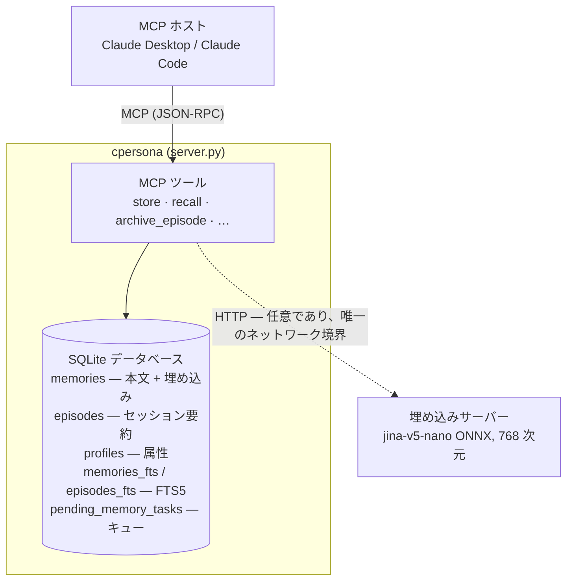
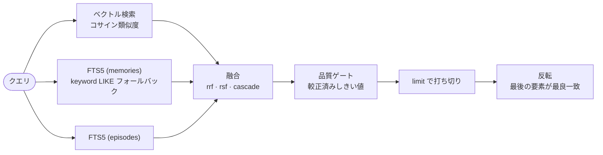

<!-- i18n-source: docs/architecture.md@blob:39bc59ea82715804ef95c85255232386a88819db -->

# アーキテクチャ

> **対象: CPersona {{ version_line }}。** このページは各部品がどう噛み合い、なぜ
> そうなっているかを説明します。呼び出し側から見える保証は
> [挙動契約](behavior-contracts.md) に置き、ここでは繰り返さずリンクします。
>
> **翻訳について**: 正本は英語版です。日本語版が古い場合は英語版を参照してください。

## 構成要素 { #the-pieces }

この形から出てくる帰結が 2 つあります。

- **埋め込みサーバーが唯一の外部依存です。** これは任意で、HTTP 越しに到達
  します。つまりネットワーク境界で壊れうる唯一の部分でもあります。だから劣化には
  [専用の検知面](operations.md#detecting-a-dead-embedding-server) があります。
  「答えが悪くなったことに誰かが気づく」に委ねていません。
- **それ以外はほぼファイル 1 つです。** 監視すべきデーモンも、用意すべき
  サービスもありません。コーパスはコピーできる `.db` です。ただし小さなファイルが
  3 つデータベースの*外*にあり、ホストを移すときに忘れられるのはこれらです。
  較正 sidecar `<CPERSONA_DB_PATH>.calibration.json` (エージェント別の閾値と
  ゲート状態)、運用者の `~/.cpersona/operating-context.toml`、そして使っている
  なら ACL ファイルです。`.db` だけを復元すると記憶はすべて戻りますが、調整は
  気づかないうちに失われます。[バックアップと復元](operations.md#backup-and-restore)
  を参照してください。

## ストレージ { #storage }

WAL モードの SQLite データベース 1 つ (`CPERSONA_DB_PATH`)、現在の
**schema v17** で、起動時に自動で前進マイグレーションされます。データ用テーブルは
`memories` / `episodes` / `profiles` / `pending_memory_tasks` の 4 つです。加えて
記録用の `schema_version` テーブルと、トリガーで同期される FTS5 仮想テーブルが
2 つあります。5 つ目のテーブル `record_nodes` は、長い記憶とエピソードの本文への
オフセットだけを持ちます ([overflow tree](OVERFLOW_TREE_DESIGN.md))。記録が削除
されるか本文が変わると、トリガーがその記録のノードを削除します。さらに 4 つ —
`entities` / `entity_aliases` / `entity_mentions` / `relations` — が
[連想記憶](ASSOCIATIVE_MEMORY_DESIGN.md) の宣言されたグラフを持ちます。entity や
記録が削除されると、それに依存していた別名・言及・関係をトリガーがすべて取り除くので、
グラフの中に消えた行を指すものは残りません。さらに 1 つ、`record_blocks` は
同じ記録を節に相当する範囲へ分け、各範囲の符号量子化ベクトルを持ちます
([Block による到達](BLOCK_REACH_DESIGN.md))。これは opt-in で、そのトリガーは
本文が変われば Block を削除し、記録が retag されれば分離軸の写しを更新します。

FTS5 索引は **trigram** トークナイザを使います。これが、CPersona が日本語や
その他の分かち書きしない文字体系で機能する理由です。単語境界ベースの
トークナイザは日本語の一文を巨大な 1 トークンとして索引してしまいますが、
trigram は語の始まりがどこであれ部分文字列でマッチします。識別子やエラー文字列
(ベクトル検索が日常的に取り逃すもの) でキーワードチャネルが働くのも同じ理由です。

WAL は稼働中に `-wal` サイドカーを持ちます。そのため**動作中のデータベースを素の
`cp` でコピーすると、チェックポイントをまたいで壊れたコピーができることが
あります**。安全な方法は
[バックアップ runbook](operations.md#backup-and-restore) にあります。

## 検索 { #retrieval }

融合段に入る **retriever は 3 本**です: ベクトル検索、memories に対する FTS5、
episodes に対する FTS5。

| Retriever | 方式 | 得意なもの |
|---|---|---|
| Vector | 保存済み埋め込みのコサイン類似度 | 意味 — 言い換え、同義語、「X についてのあれ」 |
| FTS5 (memories) | SQLite 全文検索、trigram トークナイザ | 完全な語: 名前、識別子、エラー文字列、CJK の部分文字列 |
| FTS5 (episodes) | 同じものをエピソードの要約とキーワードに対して | ある話題がどのセッションで話されたかを見つける |

**キーワード (`LIKE`) は 4 本目の retriever ではありません。** memories
チャネルの内側にフォールバックとして置かれ、FTS が無効か `MATCH` が 0 行の
ときにだけ走ります。FTS memories と並んで融合に入ることはなく、その代わりを
務めます。

**Block の腕も 4 本目の retriever ではありません。** 理由は逆で、どこにも
供給しないからです。`CPERSONA_BLOCK_RETRIEVAL_ENABLED` が on の配備では、
レコードを節に分けた Block をクエリに対して順位付けし、到達したものを品質
gate の**後**の予約へ渡します — 自分の全文ベクトルでは戻ってこられない
レコードのために確保された、固定された少数の結果席です
([Block による到達](BLOCK_REACH_DESIGN.md))。ここで見つかったものが上の 3 本と
融合されることはなく、ここで出たスコアが gate に届くこともなく、埋める席は
gate が埋めた席への追加です。設定が off の場合 (既定はどこでも off) は走りません。

`rrf` モードでのパイプライン:

4 つの段階には個別に注意を払う価値があります。いずれも呼び出し側から見える帰結を
持つからです。

1. **融合** (`CPERSONA_RECALL_MODE`)。`rrf` は順位のみで融合します。頑健で
   スケール非依存ですが、スコアの大きさを捨てます。`rsf` は各チャネルの生スコアを
   クエリ単位で正規化して加算するため、bm25 の大きさが融合後も残ります。その
   大きさは [日本語コーパス](operations.md#japanese-and-cjk-corpora) における
   識別シグナルであり、そこで `rsf` が推奨される理由です。`cascade` は
   チャネルを順に埋める方式で、レガシーです。
2. **品質ゲート**が「そもそも返してよいほど良いか」を決めます。閾値は
   `calibrate_threshold` がコーパス自身から導出し、実際に回すつまみは
   `set_recall_precision` です。全候補がゲートを下回った場合、応答は**空**で
   返ります。例外は confidence スコアリング有効時で、そのときだけゲート未満の
   字句マッチが
   [`gate_fallback`](behavior-contracts.md#8-gate_fallback-responses-are-low-confidence)
   の印つきで返ります。この印は既定構成 (confidence 無効) では到達不能なので、
   探しに行く前に知っておく価値があります。
3. **confidence スコアリング** (`CPERSONA_CONFIDENCE_ENABLED`、既定は無効) は
   メタデータのスイッチではありません。有効時は結果集合が **confidence スコアで
   並べ直され**、ゲートも融合スコアではなくそのスコアを見ます
   ([契約 §2](behavior-contracts.md#2-confidence-scoring-overrides-the-fusion-mode))。
   confidence はコサイン類似度・動的な時間減衰・解決済みかどうか・想起回数を
   混ぜた量です。したがって**マッチの強さではありません**。完全一致の行が
   言い換えの行より下に来ることは、この尺度では正当に起こりえます。
4. **最後の反転。** 結果は `limit` で切られてから反転されるので、応答は
   悪い順から良い順に並び、**末尾の要素が最良のマッチ**になります
   ([契約 §1](behavior-contracts.md#1-recall-return-order-last-is-best))。
   これは意図的です。LLM は文脈の末尾に最も強く注意を向けるため、最良の記憶を
   注入点のいちばん近くに置いています。

結果を形づくる境界が 2 つ、融合の両側にあります。`CPERSONA_MAX_MEMORIES` は
ベクトル検索の
[走査ウィンドウ](behavior-contracts.md#4-the-vector-scan-window-cpersona_max_memories)
であって保存件数の上限ではなく、融合が見られる範囲を縛ります。
[エピソード境界ペナルティ](behavior-contracts.md#3-episode-boundary-penalty)
は反対側で働き、直近の `archive_episode` より古い記憶の*融合済み*スコアに、
ゲートの前で係数を掛けます。

## 3 つの記憶タイプ { #the-three-memory-types }

- **宣言的記憶** (`store` / `recall`) — 個別の事実・決定・ルール。日常の単位です。
- **エピソード記憶** (`archive_episode`) — セッション要約。宣言的記憶と並んで
  検索対象になります。1 件アーカイブするたびに、それ以前に書かれたものを
  古びさせる境界も動きます。古いコーパスが今日の答えを溺れさせないのは、この
  働きによります。
- **プロフィール** (`update_profile`) — ユーザーやプロジェクトについて蓄積された
  属性。**スコープ内の行数 (記憶 + エピソードの合計 = ゲートが管轄するプール) が
  50 以上の場合に**限って recall 応答へ付加されます (それ未満ではゲートが
  落とします)。プレビュー切り詰めの対象外で、かつ
  [スコアを持ちません](behavior-contracts.md#7-profile-rows-carry-no-score)。
  そのため既定構成では末尾に並び、`limit` で切られることがあります。

## 分離軸 { #isolation-axes }

行は 3 つの軸で分離されます。軸は入れ子ではなく合成されます。読み取りの意味論は
**意図的に統一されていません**。軸ごとに答えている問いが違うからです。

| 軸 | 省略 (`None`) | 空 (`''`) | 値 `X` |
|---|---|---|---|
| `agent_id` | フィルタなし — 意図的なエージェント横断走査 | `''` に完全一致 | `X` に完全一致。エージェント間で行を共有しません |
| `project_id` | フィルタなし | グローバルプールのみ | `X` **に加えて**グローバルプール |
| `channel` | フィルタなし | フィルタなし | `X` に加えてチャネル無指定の行 |

この非対称性こそが要点です。

`agent_id` は和を取らないハードな分離です。エージェント間で行を共有しません。
そして `''` の束縛は範囲を広げるのではなく**狭めます**。軸を決めずに述語を
組み立てた内部コードは、空エージェントのバケットを指すのであって、他エージェントの
行に届くことはありません。このバケットは「どの書き込みも生まない値」ではなく
実在の宛先です。`store` は空の `agent_id` を受け付けます。ツールスキーマの
*required* は「キーが存在すること」であって「空でないこと」ではないからです。

**軸の省略はその逆で、意図的なエージェント横断走査です。** 一覧系ツールはそう
解釈します。`agent_id` を渡さない `list_memories` 呼び出しは、データベース内の
全エージェントの行を返します。

`project_id` はグローバルプールと和を取るので、共有文脈を各プロジェクトに
複製せずに全プロジェクトへ届けられます。`channel` は「未設定 = すべて」として
扱うため、ブリッジにチャネルを足しても、それ以前に書かれた記憶が隠れることは
ありません。

## LLM 非依存 { #zero-llm-dependency }

CPersona は生成モデルを呼びません。要約も抽出も書き換えも判定もしません。それらは
すべて呼び出し側のエージェントが行い、結果を CPersona に渡します。
`archive_episode` はあなたが計算した要約を受け取り、`update_profile` はあなたが
計算したプロフィールを受け取ります。

これは意図的な取引です。エージェント側のロジックを少し多く書く代わりに、記憶は
**API コストも、隠れたレイテンシも、非決定性も持ち込みません**。同時に、CPersona の
答えは再現できます。同じコーパスと同じクエリは同じ行を返します。これが
[ベンチマーク](https://github.com/Cloto-dev/cpersona/blob/master/benchmarks/README.md)
を測定可能にしている条件でもあります。

## バックグラウンドタスクキュー { #background-task-queue }

`pending_memory_tasks` は DB に永続化された作業キューです。起動時にワーカーが
これを掃き出し、固定間隔 (`CPERSONA_TASK_RETRY_DELAY`) で再試行します。メモリ上
ではなくデータベースにあるため、クラッシュや再起動でも作業は失われず再開されます。

**ここに投入される仕事は 2 種類あり、2 つ目は既定で off です。** `store`・
`archive_episode`・`update_memory` が埋め込み窓を超える本文を書くと、応答に
`nodes: {"status": "queued"}` が付き、`build_nodes` タスクが記録を分割して区間ごとに
埋め込みます ([overflow tree](OVERFLOW_TREE_DESIGN.md))。書き込み自体はこれを待ちません。
キューが無効 (`CPERSONA_TASK_QUEUE_ENABLED=false`) か、埋め込みサーバーがトークン数を
報告できない場合は何も投入されず、長い記録は先頭から引用されます。

2 つ目は `build_blocks` で、`CPERSONA_BLOCK_BUILD_ENABLED` が on の配備でだけ走ります
([Block による到達](BLOCK_REACH_DESIGN.md))。長い記録だけでなく**すべての記録**に対して
投入されます — 短い記録も節には分かれるからで、分割が 1 Block にしかならない場合はタスク自身が
辞退します。設定が off の場合 (既定はどこでも off) は何も投入されず、埋め込み呼び出しも
発生しません。

同じ設定は起動時にもう 1 つタスクを積みます。`backfill_blocks` は、配備が opt-in した時点で
すでに保存されていた記録を sweep します。sweep は同時に 1 つだけ存在します。レコード数・
文字数・埋め込み呼び出し数・経過時間のいずれかの上限で止まり、自分の継続をキューへ積むので、
コーパスは有界な run の連なりとして構築され、再起動しても最初からではなく前回が止まった
あたりから再開します。

このキューはもともとサーバー側でのエピソード要約生成のために存在しましたが、その機能は
v2.4.10 より前に削除されました。`archive_episode` は今も事前計算された要約を要求して
行を直接書き、プロフィール更新も同期的です。古い版が残した行も正しく完了されます。

`get_queue_status` は深さと再試行を報告します。深さは長い書き込みの直後に一時的に
増え、ノードが構築されると 0 に戻ります。深さが下がらない場合は構築が失敗して
再試行を繰り返しており、多くは埋め込みサーバーに到達できないことが原因です。Block の構築が
on の配備では、コーパスが覆われるまで sweep タスクが 1 つキューに載り続けるので、そこでの
深さ 1 は症状ではなく backfill が働いていることを意味します。

## トランスポート { #transports }

既定は **stdio** で、MCP クライアントがプロセスを所有し、ネットワークは介在
しません。`CPERSONA_TRANSPORT=streamable-http` は代わりに HTTP で複数クライアントへ
提供します。この時点でサーバーは認証について判断を迫ります。`CPERSONA_AUTH_TOKEN`
を設定するか、ACL ファイルを構成するか、`CPERSONA_ALLOW_UNAUTHENTICATED_HTTP=true`
で「認証なしでよい」と明示するかです。v2.5.3 はこの拒否を**無条件**にしました。
それ以前の版は bind アドレスから判断していましたが、それは到達可能性の境界では
ありません。要件およびクライアント別 ACL は
[リモート HTTP トランスポート](configuration.md#remote-http-transport)
で扱います。

stdio ではクライアントがプロセスを所有し、サーバーは**待ち受けポートを
開きません**。外部から接続することはできません。ただし完全なオフラインでは
ありません。既定ではプロセス起動ごとに 1 回だけ*外向き*の接続を `pypi.org` に
対して行い、このプロジェクトの公開パッケージインデックスを要求して応答を読みます。
新しいリリースの存在や、今動いているリリースが撤回されたことを伝えられるのは、
この経路のおかげです。

このデプロイに関する情報は何も送りません。識別子もコーパスも設定も送らず、
リクエストは `pip install` が行うものと同じで、User-Agent は httpx の既定値です。
保存するのはデータベースの隣に置く小さな JSON ファイル (`update-check.json`) だけ
で、判定内容と取得時刻を持ちます。おかげで 24 時間以内の再起動ではリクエストが
1 回も発生しません。

`CPERSONA_UPDATE_CHECK=false` で全体を無効化できます。取得もファイルも通知も
ありません。明示的な [`check_update(apply=true)`](tools.md#server-version) なしに
何かがインストールされることはありません。