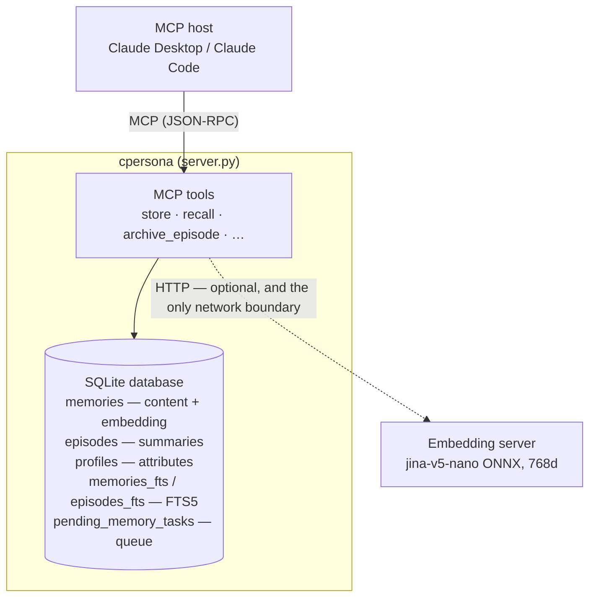
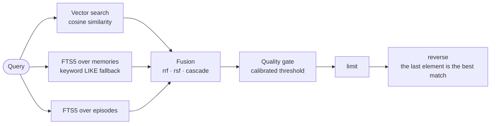

# Architecture

> **Applies to: CPersona {{ version_line }}.** This page explains how the pieces fit
> together and why. Where a mechanism has a guarantee the caller can rely on,
> that guarantee lives in [Behavior Contracts](behavior-contracts.md) and is
> linked from here rather than repeated.

## The pieces

Two things follow from this shape:

- **The embedding server is the only external dependency.** It is optional,
  and it is reached over HTTP, which makes it the only part that can fail at a
  network boundary. That is why degradation has [its own detection
  surface](operations.md#detecting-a-dead-embedding-server), rather than
  showing up as answers that quietly got worse.
- **Almost everything else is one file.** There is no daemon to supervise and
  no service to provision: the corpus is a `.db` you can copy. Three small
  files live *outside* it, and they are the ones people forget when moving
  hosts — the calibration sidecar
  `<CPERSONA_DB_PATH>.calibration.json` (per-agent thresholds and gate state),
  the operator's `~/.cpersona/operating-context.toml`, and the ACL file if you
  use one. Restoring the `.db` alone restores every memory and silently loses
  the tuning. See [backup and restore](operations.md#backup-and-restore).

## Storage

One SQLite database in WAL mode (`CPERSONA_DB_PATH`), currently **schema
v16**, migrated forward automatically on startup. It holds four data tables —
`memories`, `episodes`, `profiles`, `pending_memory_tasks` — plus a
`schema_version` bookkeeping table and two FTS5 virtual tables that triggers
keep in step. A fifth table, `record_nodes`, holds only offsets into the text of
long memories and episodes ([overflow tree](OVERFLOW_TREE_DESIGN.md)); triggers
delete a record's nodes when the record is deleted or its text changes. Four
more — `entities`, `entity_aliases`, `entity_mentions`, `relations` — hold the
declared graph of [associative memory](ASSOCIATIVE_MEMORY_DESIGN.md); triggers
remove every alias, mention and relation that depended on a deleted entity or
record, so nothing in the graph ever points at a row that is gone. One more,
`record_blocks`, divides those same records into clause-sized spans and holds a
sign-quantised vector for each ([block reach](BLOCK_REACH_DESIGN.md)); it is
opt-in, and its triggers both drop a record's blocks when its text changes and
move their copy of the isolation axes when the record is retagged.

The FTS5 indexes use the **trigram** tokenizer. That is what makes CPersona
work on Japanese and other space-less scripts at all. A word-boundary
tokenizer indexes a Japanese sentence as one enormous token; trigrams match
substrings wherever words begin. It is also why the keyword channel earns its
keep on identifiers and error strings, which vector search routinely misses.

WAL keeps a live `-wal` sidecar, so **a plain `cp` of a running database can
straddle a checkpoint and produce a corrupt copy**. The
[backup runbook](operations.md#backup-and-restore) gives the safe forms.

## Retrieval

**Three retrievers** feed the fusion step: vector search, FTS5 over memories,
and FTS5 over episodes.

| Retriever | Method | What it is good at |
|---|---|---|
| Vector | Cosine similarity over stored embeddings | Meaning — paraphrases, synonyms, "the thing about X" |
| FTS5 (memories) | SQLite full-text search, trigram tokenizer | Exact terms: names, identifiers, error strings, CJK substrings |
| FTS5 (episodes) | The same, over episode summaries and keywords | Finding the session in which something was discussed |

A **keyword (`LIKE`) pass is not a fourth retriever.** It sits inside the
memories channel as a fallback, and runs only when FTS is disabled or its
`MATCH` returns nothing. It never merges alongside the FTS memories retriever
— it stands in for it.

The pipeline in `rrf` mode:

Four stages deserve individual attention, because each one has a consequence
the caller can see:

1. **Fusion** (`CPERSONA_RECALL_MODE`). `rrf` merges by rank alone. It is
   robust and scale-free, and it discards score magnitude. `rsf` normalizes
   each channel's raw score per query and sums them, so bm25 magnitude
   survives the merge. That magnitude is the discriminating signal on
   [Japanese corpora](operations.md#japanese-and-cjk-corpora), which is why
   `rsf` is recommended there. `cascade` fills channels one after another and
   is legacy.
2. **The quality gate** decides what is good enough to return at all. Its
   threshold is derived from the corpus by `calibrate_threshold`, and
   `set_recall_precision` is the knob you actually turn. When every candidate
   falls below it, the response comes back **empty**. The exception is
   confidence scoring: there the below-gate lexical matches are returned,
   marked with
   [`gate_fallback`](behavior-contracts.md#8-gate_fallback-responses-are-low-confidence).
   That marker is unreachable in the default configuration (confidence off),
   which is worth knowing before you go looking for it.
3. **Confidence scoring** (`CPERSONA_CONFIDENCE_ENABLED`, off by default) is
   not a metadata switch. With it on, the result set is **re-sorted by the
   confidence score**, and the gate keys on that score instead of the fused
   one
   ([contract §2](behavior-contracts.md#2-confidence-scoring-overrides-the-fusion-mode)).
   Confidence blends cosine similarity, dynamic time decay, resolved status
   and recall count. It is therefore **not** match strength, and an exact
   match can legitimately rank below a paraphrase on that scale.
4. **The final reverse.** Results are cut to `limit` and then reversed, so the
   response runs worst to best and **the last element is the strongest match**
   ([contract §1](behavior-contracts.md#1-recall-return-order-last-is-best)).
   This is deliberate: LLMs attend most strongly to the end of their context,
   so the best memory is placed nearest the injection point.

Two bounds sit on either side of fusion. `CPERSONA_MAX_MEMORIES` is the
vector retriever's
[scan window](behavior-contracts.md#4-the-vector-scan-window-cpersona_max_memories),
not a storage cap, and it bounds what fusion ever gets to see. The
[episode boundary penalty](behavior-contracts.md#3-episode-boundary-penalty)
works on the other side: it multiplies the *already fused* score of memories
older than the most recent `archive_episode`, before the gate runs.

## The three memory types

- **Declarative** (`store` / `recall`) — individual facts, decisions, rules.
  The everyday unit.
- **Episodic** (`archive_episode`) — session summaries. They are searched
  alongside declarative memories. Archiving one also moves the boundary that
  ages everything written before it, which is what keeps an old corpus from
  drowning today's answers.
- **Profile** (`update_profile`) — accumulated attributes about the user or
  project. It is appended to recall responses **when the scope holds at least
  50 rows** (memories and episodes together, the pool the gate governs; below
  that the gate drops it). It is never preview-trimmed, and it
  [carries no score](behavior-contracts.md#7-profile-rows-carry-no-score), so
  in the default configuration it sorts last and can be cut by `limit`.

## Isolation axes

Rows are separated on three axes. The axes compose rather than nest, and
their read semantics are deliberately **not** uniform, because they answer
different questions:

| Axis | Omitted (`None`) | Empty (`''`) | A value `X` |
|---|---|---|---|
| `agent_id` | no filter — a deliberate cross-agent scan | exact match on `''` | exact match on `X`; agents never share rows |
| `project_id` | no filter | the global pool only | `X` **plus** the global pool |
| `channel` | no filter | no filter | `X` plus channel-less rows |

The asymmetry is the point.

`agent_id` is hard isolation with no union: agents never share rows. Binding
it to `''` narrows rather than widens, so internal code that assembles a
predicate without deciding the axis addresses the empty-agent bucket, never
another agent's rows. That bucket is a real address, not a value no write
produces — `store` accepts an empty `agent_id`, because *required* in a tool
schema means present, not non-empty.

**Omitting the axis is the opposite case, and it is deliberate: a cross-agent
scan.** The listing tools take it that way. A `list_memories` call with no
`agent_id` returns rows belonging to every agent in the database.

`project_id` unions with the global pool, so shared context reaches every
project without being copied into each. `channel` treats "unset" as
"everything", so adding a channel to a bridge never hides the memories written
before it existed.

## Zero LLM dependency

CPersona never calls a generative model. It does not summarize, extract,
rewrite, or judge. The calling agent does all of that and hands CPersona the
result: `archive_episode` takes the summary you computed, and `update_profile`
takes the profile you computed.

This is a deliberate trade. You write slightly more agent-side logic, and in
exchange memory adds **no API cost, no hidden latency, and no
nondeterminism**. It also means a CPersona answer can be reproduced: the same
corpus and query return the same rows, which is what makes the
[benchmarks](https://github.com/Cloto-dev/cpersona/blob/master/benchmarks/README.md)
measurable at all.

## Background task queue

`pending_memory_tasks` is a work queue persisted in the database, with a
worker that drains it at startup and retries failed tasks on a fixed delay
(`CPERSONA_TASK_RETRY_DELAY`). Because it lives in the database rather than in
memory, a crash or a restart resumes the work instead of losing it.

**Two things enqueue onto it, and the second is off by default.** When `store`,
`archive_episode` or `update_memory` writes a text that runs past the embedding
window, the response carries `nodes: {"status": "queued"}` and a `build_nodes`
task divides the record and embeds each span
([overflow tree](OVERFLOW_TREE_DESIGN.md)). The write itself does not wait for
it. With the queue disabled (`CPERSONA_TASK_QUEUE_ENABLED=false`), or with an
embedding server that cannot report tokens, nothing is queued and a long record
is quoted from its start.

The second is `build_blocks`, which runs only where
`CPERSONA_BLOCK_BUILD_ENABLED` is on ([block reach](BLOCK_REACH_DESIGN.md)). It
is queued for every record rather than only the long ones, because a short
record still divides into clauses, and the task declines by itself when the
division yields a single block. Where the setting is off — which is everywhere
by default — nothing is queued and no embedding call is made.

The queue first existed for server-side episode summarisation, which was
removed before v2.4.10; `archive_episode` still requires a pre-computed summary
and writes the row directly, and profile updates are synchronous. Rows left
behind by an older version are still completed correctly.

`get_queue_status` reports depth and retries. Depth rises briefly after a long
write and returns to zero once its nodes are built; a depth that stays up means
the builds are failing and retrying, usually because the embedding server is
unreachable.

## Transports

The default is **stdio**: the MCP client owns the process, and no network is
involved. `CPERSONA_TRANSPORT=streamable-http` serves several clients over
HTTP instead, and at that point the server makes you decide about
authentication. Set `CPERSONA_AUTH_TOKEN`, configure an ACL file, or say
explicitly with `CPERSONA_ALLOW_UNAUTHENTICATED_HTTP=true` that you want none.
v2.5.3 made that refusal **unconditional**; earlier versions inferred it from
the bind address, which is not a reachability boundary. The requirements and
per-client ACLs are covered in
[Remote HTTP transport](configuration.md#remote-http-transport).

Under stdio the client owns the process and the server opens **no listening
port**, so nothing can connect to it. It is not entirely offline, though. By
default it makes one *outbound* connection per process start, to `pypi.org`,
asking for this project's public package index and reading the answer. That is
how it can tell you a newer release exists, or that the release you are
running has been withdrawn.

It sends nothing about this deployment: no identifier, no corpus, no
configuration. The request is the same one any `pip install` makes, and the
User-Agent is httpx's default. What it keeps is a small JSON file beside the
database (`update-check.json`) holding the verdict and when it was fetched, so
a restart within the next 24 hours makes no request at all.

Set `CPERSONA_UPDATE_CHECK=false` to switch the whole thing off: no fetch, no
file, no notice. Nothing is ever installed without an explicit
[`check_update(apply=true)`](tools.md#server-version).